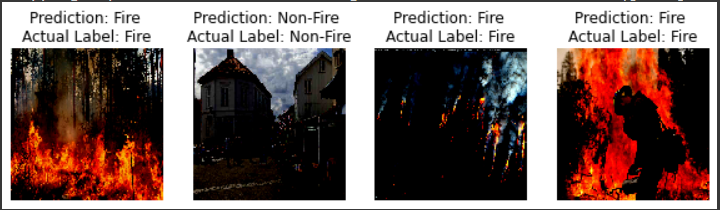
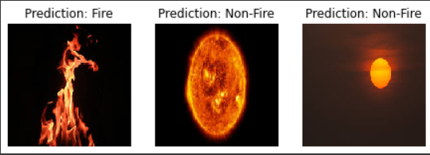
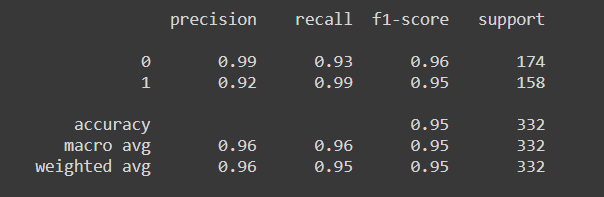
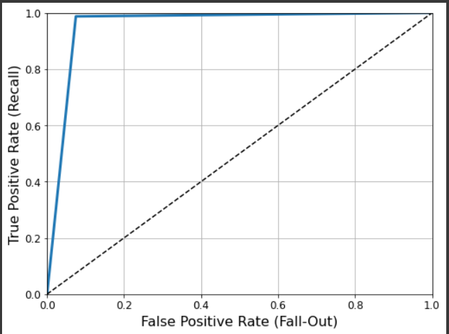

# Fire-Detection
  

This repo consists of the Fire Detection project, gives 0.96 ROC-AUC score using MobileNetV2. 

## Datasets 
I have used [this](https://www.kaggle.com/phylake1337/fire-dataset) dataset and few more images from the Google. At the end, I have `867` images for a class **`fire`** and `787` images for a class **`non-fire`**. If you would like to have the exact same dataset as mine, you can download it from [here.](https://drive.google.com/file/d/1CcjzRNUUrFLegSIZBZ3KQZhuRbGn_CCN/view?usp=sharing)

### Data Preprocessing
As all the images in the datasets were in the different shapes, I have loaded the images with fixed shape (224, 224, 3). Then I have converted the image labels into numbers using `LabelBinarizer` and then performed `one_hot_encoding`.

### Data Augmentation
I have performed the Data Augmentation using the `ImageDataGenerator` class of the keras with different parameters including `rotation_range`, `shear_range`, `zoom_range`, etc.

## Model Architecture
I have used `MobileNetV2` as a basemodel and a few more `Dense`, `AveragePooling2D` and `Dropout` layers on top of it.  

### Hyperparameters  

Following is the Hyperparameters values which I have used in this porject.  

Name | Value
-----|------
Learning Rate | 0.0001
Epochs | 20
Batch Size | 32
Optimizer | Adam
Activation Function | Relu(Hidden layers) and Softmax(Last layer)
Loss Function | Binary Cross Entropy

## Results 

### On Test-set Images
  

As you can see in the above images that the model has correctly classified all the images. Now, let's test our model on custom test images. 
### On Custom Images
  

Again, all correctly classified. Note that the second image is of the sun which looks like a fire but our model has correctly classified that too. 
## Evaluation
### Classification Report
  

### ROC-AUC Curve

## Limitations and Future Scope
Our dataset consists of the images in which large portion of it is of fire. So this model fails in detecting a small portion of fire in an image. Furthermore, This model might fails if we deploy this model using a street-camera as our dataset consists of the high resolution images and that's not the case in a real life scenario. 
